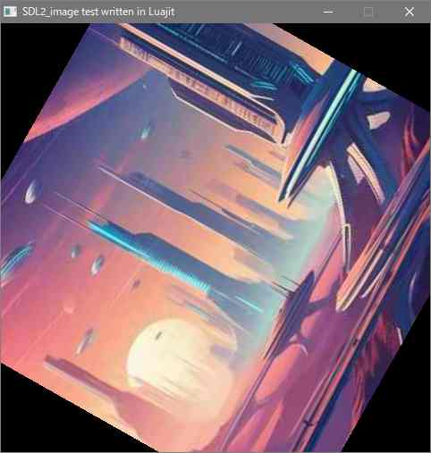

### luajit-sdl2_image

---

SDL2_image library for LuaJIT

This project is mainly used [luajit-platformer](https://github.com/dinau/luajit-platformer).

#### Test program

---

On Windows OS,  
it needs to be installed **SDL2.dll** and **SDL2_image.dll** to current directory at least.  
Also needs **luajit.exe** binary.

```sh
git clone https://github.com/dinau/luajit-sdl2_image
cd luajit-sdl2_image
cd test
test.bat
```

`test.bat` is the image load test program.


